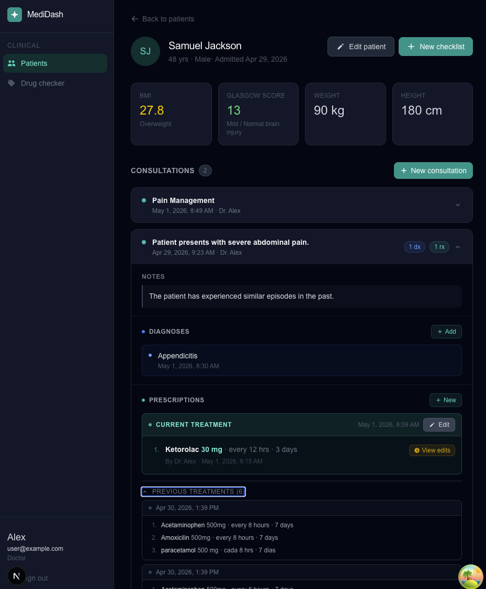
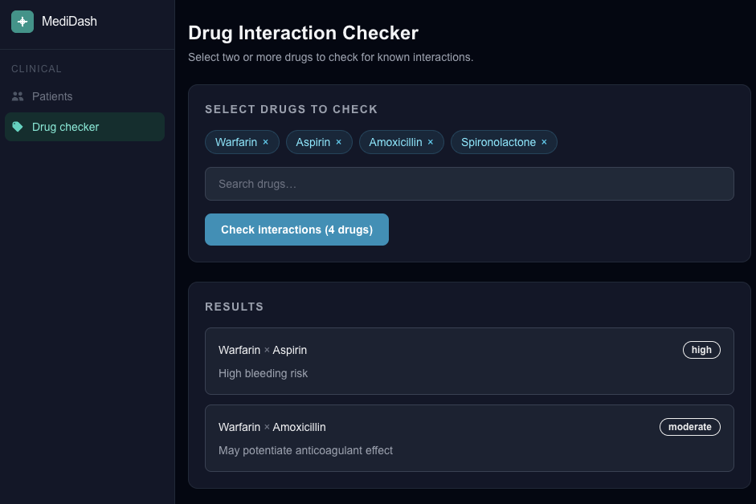

# MediDash

> Full-stack clinical dashboard for doctors and nurses — role-based access, real-time risk scoring, drug interaction detection, and complete consultation history in one place.


| | |
|---|---|
| **Live Demo** | [medidash-frontend.vercel.app](https://medidash-frontend.vercel.app) |
| **API Docs** | [medidash-backend.onrender.com/docs](https://medidash-backend.onrender.com/docs) |
| **Frontend Repo** | [github.com/Meva1997/medidash-frontend](https://github.com/Meva1997/medidash-frontend) |
| **Backend Repo** | [github.com/Meva1997/medidash-backend](https://github.com/Meva1997/medidash-backend) |

> **Demo credentials** — User: `user@example.com` · Password: `String97`

---

## Screenshots

### Patient Detail — Consultations, Diagnoses & Prescriptions


### Drug Interaction Checker


---

## Overview

MediDash is a production-quality, full-stack medical dashboard modeled after real clinical workflows. It enforces **role-based access control** (doctor vs. nurse), computes patient risk scores server-side, flags dangerous drug combinations before they reach a patient, and maintains a complete, versioned consultation history — including diagnoses and prescriptions — per patient.

The project goes well beyond a generic CRUD app: it implements a versioned prescription model, prescription edit history with diff rendering, pairwise drug interaction detection with deduplication, and a WHO surgical safety checklist embedded per patient.

---

## Key Technical Decisions

| Decision | Why |
|---|---|
| TanStack Query v5 | Optimistic cache, background refetch, and per-hook stale times — avoids prop-drilling or global loading state |
| React Hook Form + Zod | Runtime + type-level form validation from a single schema (`lib/schemas/`) |
| Prescription versioning | Each `Prescription` tracks `original_id`, `superseded_at`, and `superseded_by` — full edit history fetchable without extra tables |
| Axios interceptor on 401 | Centralized auth expiry handling: any failed request auto-redirects to `/login` |
| Route guard in `proxy.ts` | Next.js middleware-level redirect before any page renders; `/login` and `/register` are public |
| Dark-only UI | Consistent dark palette (`bg-gray-950`) via a single `class="dark"` on `<html>` |

---

## Features

### Authentication & Role-Based Access
- JWT auth with `doctor` and `nurse` roles assigned server-side and returned in the login response
- Self-registration via `/register` with full name, email, password, and role selection
- Cookie-based token storage via `js-cookie`; `User` object persisted in `localStorage`
- Route guard in `proxy.ts`: unauthenticated users redirected to `/login`, authenticated users away from `/login` and `/register`
- Axios instance auto-redirects on 401, except on the login endpoint itself (prevents redirect loop on bad credentials)
- Doctors: full patient management, consultation creation, diagnosis/prescription entry, checklist creation
- Nurses: patient data editing (`weight_kg`, `height_cm`, `glasgow_score`), checklist item toggling, read-only consultation history

### Patient Management
- Patient list with live search, role-gated "Admit patient" button, and delete with confirmation dialog
- Admit/edit form validated with **React Hook Form + Zod**: `full_name`, `age`, `gender` (`M`/`F`/`X`), `weight_kg`, `height_cm`, `glasgow_score`
- Edit existing records via modal on the patient detail page (`PUT /patients/{id}`) — available to both doctors and nurses
- Server-computed BMI (with color-coded category) and Glasgow Coma Scale interpretation rendered inline

### Consultations & Prescriptions
- Full consultation history per patient with expandable cards showing dx/rx count badges
- Prescription versioning: each prescription tracks its full edit history — a "View edits" button renders previous values inline with strikethrough styling
- Prescriptions belong to a `Treatment` entity; only one treatment is `is_active` per consultation, with previous ones collapsible
- 10 route-of-administration options (oral, IV, IM, subcutaneous, topical, inhalation, sublingual, rectal, ophthalmic, otic)
- Nurses have read-only access to consultation history

### Drug Interaction Checker
- Full-catalog drug search
- Pairwise interaction detection across any combination
- Severity-level alerts with clinical descriptions
- Symmetric deduplication (A→B checked once)

### Surgical Checklists
- Doctor-initiated checklists pre-populated with 10 WHO surgical safety steps
- Item-level completion tracking with timestamps
- Per-patient checklist history embedded on the detail page

---

## Tech Stack

### Frontend
| | |
|---|---|
| Framework | Next.js 16 (App Router) |
| Language | TypeScript 5 |
| UI | React 19 |
| Styling | TailwindCSS v4 |
| Data Fetching | TanStack Query v5 |
| Forms | React Hook Form v7 + Zod v4 |
| HTTP | Axios (interceptor-based auth) |
| Auth State | React Context + js-cookie (SSR-safe) |

### Backend
| | |
|---|---|
| Framework | FastAPI |
| Language | Python 3.11 |
| ORM | SQLAlchemy (sync) |
| Migrations | Alembic |
| Auth | JWT (python-jose) + bcrypt |
| Database | PostgreSQL |

### Infrastructure
| | |
|---|---|
| Frontend | Vercel |
| Backend | Render |
| Database | Render PostgreSQL |

---

## API Overview

| Method | Endpoint | Auth | Role |
|---|---|---|---|
| POST | `/auth/register` | — | — |
| POST | `/auth/login` | — | — |
| GET | `/patients/` | JWT | any |
| GET | `/patients/{id}` | JWT | any |
| POST | `/patients/` | JWT | doctor |
| PUT | `/patients/{id}` | JWT | doctor / nurse* |
| DELETE | `/patients/{id}` | JWT | doctor |
| GET | `/drugs/` | JWT | any |
| POST | `/drugs/interactions` | JWT | any |
| POST | `/checklists/` | JWT | doctor |
| GET | `/checklists/{id}` | JWT | any |
| GET | `/checklists/patient/{patient_id}` | JWT | any |
| PATCH | `/checklists/{id}/items/{item_id}` | JWT | any |
| POST | `/patients/{patient_id}/consultations` | JWT | doctor |
| GET | `/patients/{patient_id}/consultations` | JWT | any |
| GET | `/consultations/{consultation_id}` | JWT | any |
| POST | `/consultations/{consultation_id}/diagnoses` | JWT | doctor |
| PATCH | `/consultations/{consultation_id}/diagnoses/{diagnosis_id}` | JWT | doctor |
| GET | `/consultations/{consultation_id}/diagnoses/{diagnosis_id}/history` | JWT | any |
| POST | `/consultations/{consultation_id}/treatments` | JWT | doctor |
| GET | `/consultations/{consultation_id}/treatments` | JWT | any |
| PATCH | `/consultations/{consultation_id}/treatments/{treatment_id}/prescriptions/{prescription_id}` | JWT | doctor |
| GET | `/consultations/{consultation_id}/treatments/{treatment_id}/prescriptions/{prescription_id}/history` | JWT | any |

*Nurses restricted to `weight_kg`, `height_cm`, and `glasgow_score` fields.

Full interactive docs: [medidash-backend.onrender.com/docs](https://medidash-backend.onrender.com/docs)

---

## Local Development

### Prerequisites
- Node.js 18+
- Python 3.11+
- PostgreSQL

### Frontend

```bash
git clone https://github.com/Meva1997/medidash-frontend
cd medidash-frontend
npm install
cp .env.example .env.local
npm run dev
```

**.env.local**
```
NEXT_PUBLIC_API_URL=http://localhost:8000
```

### Backend

```bash
git clone https://github.com/Meva1997/medidash-backend
cd medidash-backend
python -m venv venv
source venv/bin/activate
pip install -r requirements.txt
cp .env.example .env
alembic upgrade head
uvicorn app.main:app --reload
```

**.env**
```
DATABASE_URL=postgresql://user@localhost:5432/medidash
SECRET_KEY=your-secret-key
ALGORITHM=HS256
ACCESS_TOKEN_EXPIRE_MINUTES=30
```

---

## Project Structure

```
medidash-frontend/
├── app/
│   ├── (auth)/
│   │   ├── login/             # Login page with click-to-copy demo credentials
│   │   └── register/          # Registration page (full name, email, password, role)
│   └── (dashboard)/           # Protected layout (Sidebar only)
│       ├── patients/          # Patient census + admit modal
│       ├── patients/[id]/     # Patient detail: stats + consultations + checklists
│       └── drugs/             # Drug interaction checker
├── components/
│   ├── ui/                    # Button, Badge, Card, Input, ConfirmDialog, DemoCredentials
│   ├── layout/                # Sidebar (role-aware nav, full name display, logout)
│   ├── patients/              # PatientTable, PatientForm, PatientProfile
│   ├── consultations/         # ConsultationsPanel, PrescriptionItem (with edit history)
│   ├── drugs/                 # InteractionChecker
│   └── checklists/            # ChecklistPanel (embedded in PatientProfile)
├── hooks/                     # TanStack Query hooks
│   ├── usePatients.ts
│   ├── useConsultations.ts    # includes useAddPrescription, useUpdateTreatment, usePrescriptionHistory
│   ├── useChecklists.ts
│   ├── useDrugs.ts
│   └── useRegister.ts         # registration mutation
├── lib/
│   ├── api.ts                 # Axios instance (auto-redirect on 401)
│   ├── schemas/               # Zod schemas (patient.schema.ts)
│   └── utils.ts               # cn, getBMIColor, getGlasgowColor
├── context/                   # AuthContext, QueryProvider
├── proxy.ts                   # Route guard
└── types/                     # Shared TypeScript interfaces
```

---

## Author

**Alex** — Full Stack Developer
[GitHub](https://github.com/Meva1997) · [LinkedIn](https://www.linkedin.com/in/alex-fullstack-developer/)

---

## License

MIT
